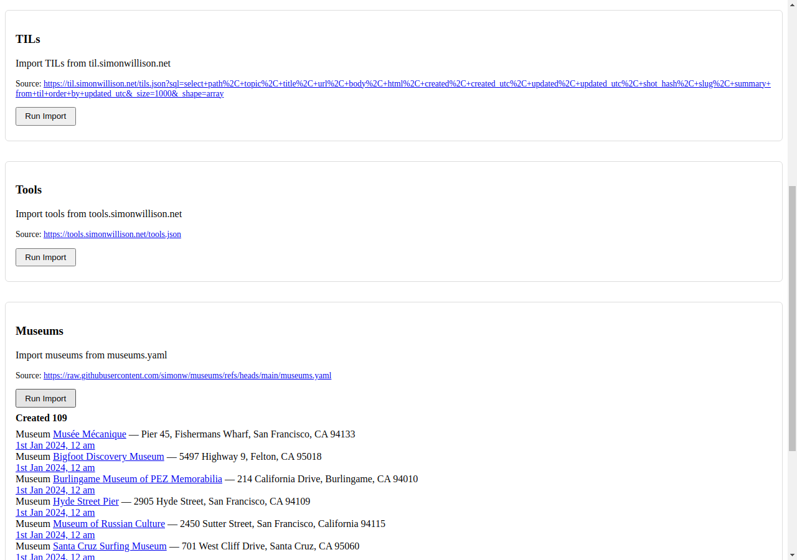
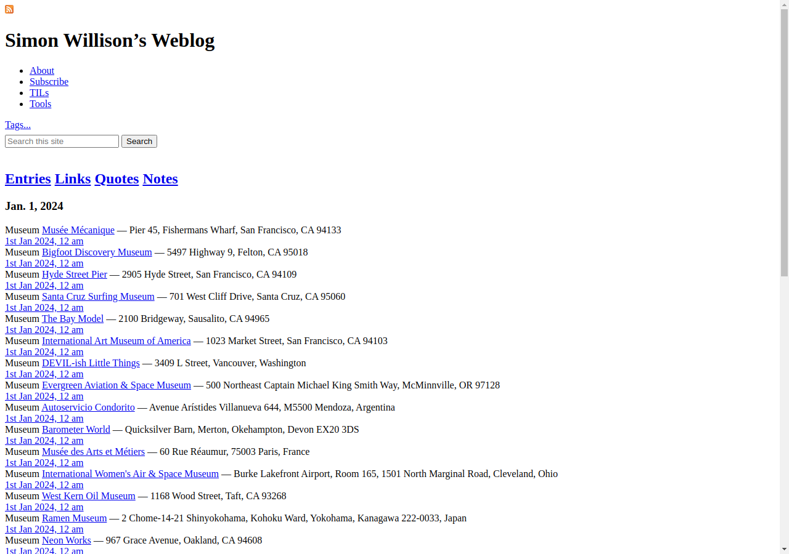

# Museums Beat Importer

*2026-02-19T16:01:58Z by Showboat 0.6.0*
<!-- showboat-id: a57ca048-a2ae-4727-8477-d2392cc52d9e -->

A new Beat importer for Museums that fetches data from a YAML file of museums. Each museum becomes a Beat with the museum name as title, website URL, and address as commentary.

## Model Change

Added `MUSEUM = "museum", "Museum"` to the BeatType choices.

```bash
grep -n 'MUSEUM' /home/user/simonwillisonblog/blog/models.py
```

```output
563:        MUSEUM = "museum", "Museum"
```

## Importer Function

The `import_museums()` function in `blog/importers.py` fetches YAML, parses each museum, skips entries without a URL, and uses `_create_or_update()` for idempotent imports.

```bash
sed -n '224,272p' /home/user/simonwillisonblog/blog/importers.py
```

```output

def import_museums(url):
    response = httpx.get(url)
    response.raise_for_status()
    museums = yaml.safe_load(response.text)

    created_count = 0
    updated_count = 0
    skipped_count = 0
    items = []

    for museum in museums:
        museum_id = museum["id"]
        import_ref = "museum:{}".format(museum_id)
        museum_url = museum.get("url") or ""
        if not museum_url:
            continue

        name = museum["name"]
        description = truncate(museum.get("description") or "")
        address = museum.get("address") or ""

        slug = re.sub(r"[^a-z0-9]+", "-", name.lower()).strip("-")
        created = datetime(2024, 1, 1, tzinfo=timezone.utc)

        defaults = {
            "beat_type": "museum",
            "title": name,
            "url": museum_url,
            "slug": unique_slug(slug, created, import_ref),
            "created": created,
            "commentary": address,
        }

        beat, status = _create_or_update(import_ref, defaults)
        if status == "created":
            created_count += 1
            items.append(beat)
        elif status == "updated":
            updated_count += 1
            items.append(beat)
        else:
            skipped_count += 1

    return {
        "created": created_count,
        "updated": updated_count,
        "skipped": skipped_count,
        "items": items,
```

## Management Command

```bash
cat /home/user/simonwillisonblog/blog/management/commands/import_museums.py
```

```output
from django.core.management.base import BaseCommand

from blog.importers import import_museums


class Command(BaseCommand):
    help = "Import museums from a YAML URL as Beat objects with beat_type='museum'"

    def add_arguments(self, parser):
        parser.add_argument("url", help="URL to a museums.yaml file")

    def handle(self, *args, **options):
        result = import_museums(options["url"])
        self.stdout.write(
            "Created {}, updated {}, skipped {}".format(
                result["created"], result["updated"], result["skipped"]
            )
        )
```

## Web UI Integration

The Museums importer is registered in the IMPORTERS dict in `blog/views.py` so it appears in the admin Beat Importers page.

```bash
grep -A4 '"museums"' /home/user/simonwillisonblog/blog/views.py | head -5
```

```output
    "museums": {
        "name": "Museums",
        "description": "Import museums from museums.yaml",
        "url": "https://raw.githubusercontent.com/simonw/museums/refs/heads/main/museums.yaml",
    },
```

## CSS Styling

A teal badge for the museum beat label, with dark mode support.

```bash
grep -A3 'beat-label.museum' /home/user/simonwillisonblog/static/css/all.css
```

```output
.beat-label.museum {
  background: #e0f2f1;
  color: #00695c;
  border: 1px solid #80cbc4;
--
[data-theme="dark"] .beat-label.museum          { background: #0a2622; color: #4db6ac; border-color: #1a5c52; }

@media (prefers-color-scheme: dark) {
  :root:not([data-theme]) .beat-label.release    { background: var(--color-purple-light); color: var(--color-purple-accent); border-color: var(--color-purple-border); }
--
  :root:not([data-theme]) .beat-label.museum          { background: #0a2622; color: #4db6ac; border-color: #1a5c52; }
}
```

## Tests

Three new tests verify the importer: basic import, skipping museums without URLs, and skipping unchanged data on re-import.

```bash
source /home/user/simonwillisonblog/.venv312/bin/activate && DATABASE_URL=postgres://postgres@localhost/test_db python /home/user/simonwillisonblog/manage.py test blog.tests.ImporterViewTests.test_api_run_importer_museums blog.tests.ImporterViewTests.test_api_run_importer_museums_skips_no_url blog.tests.ImporterViewTests.test_api_run_importer_museums_skips_unchanged -v2 2>&1 | tail -10
```

```output
  mw_instance = middleware(adapted_handler)
ok
test_api_run_importer_museums_skips_no_url (blog.tests.ImporterViewTests.test_api_run_importer_museums_skips_no_url) ... ok
test_api_run_importer_museums_skips_unchanged (blog.tests.ImporterViewTests.test_api_run_importer_museums_skips_unchanged) ... ok

----------------------------------------------------------------------
Ran 3 tests in 3.787s

OK
Destroying test database for alias 'default' ('test_test_db')...
```

## Screenshots

Admin importers page after clicking the Museums import button (109 museums created):

```bash {image}
/home/user/simonwillisonblog/screenshot-importers.png
```



Homepage with beats toggled visible, showing imported Museum beats:

```bash {image}
/home/user/simonwillisonblog/screenshot-homepage.png
```


